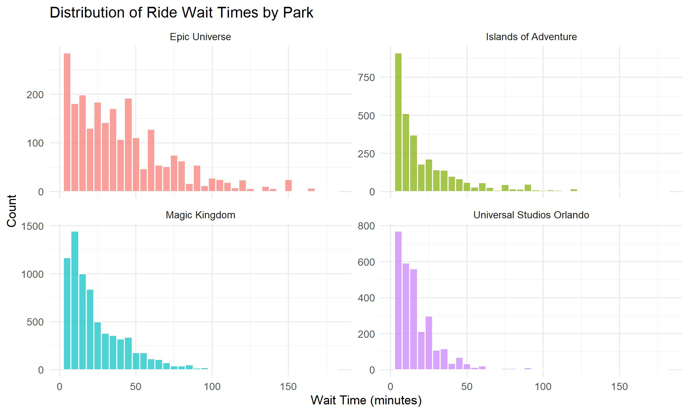
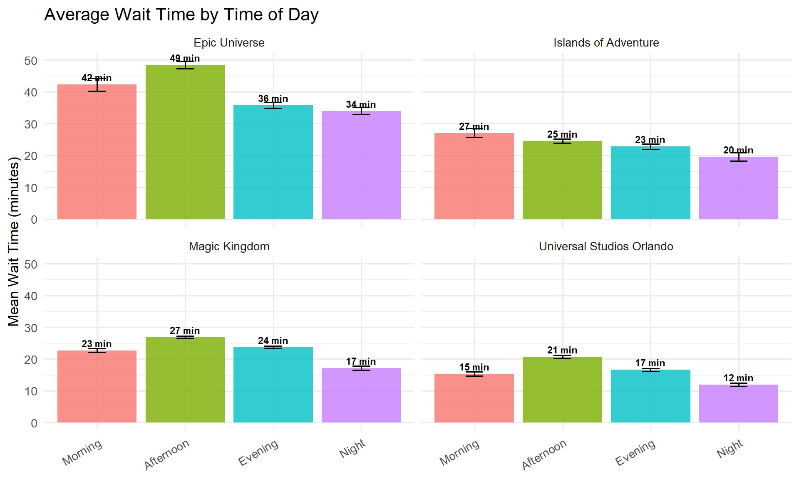
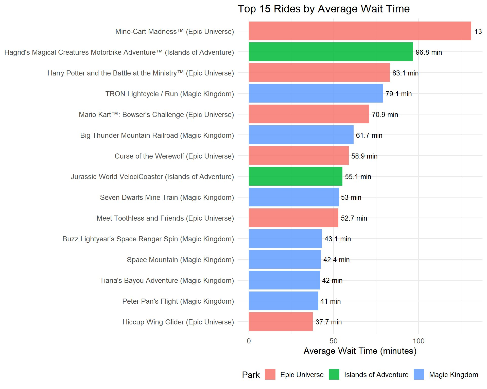
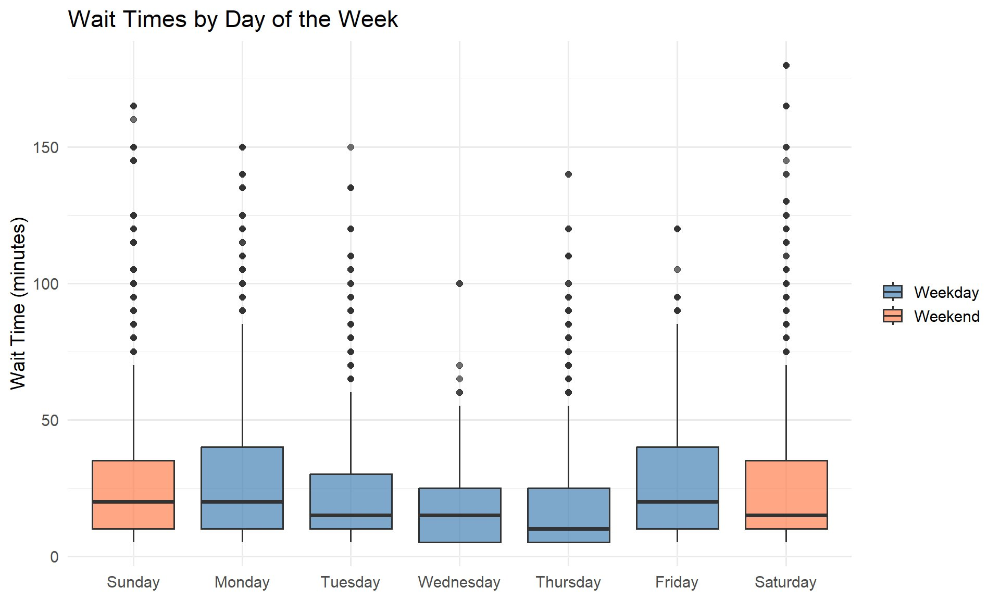
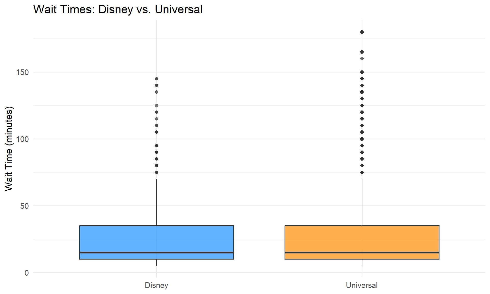
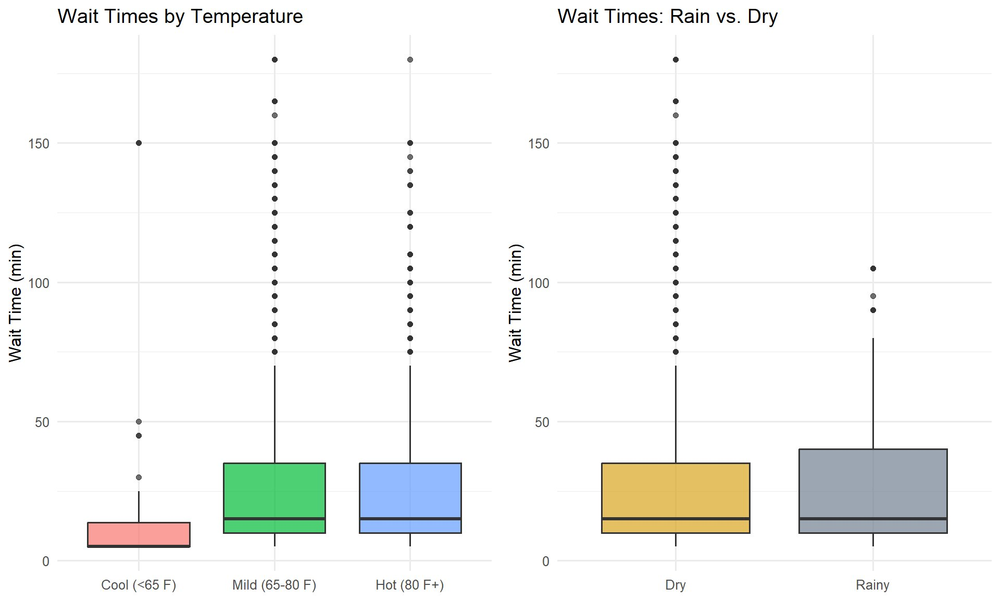
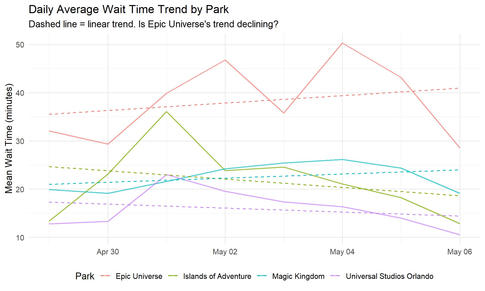
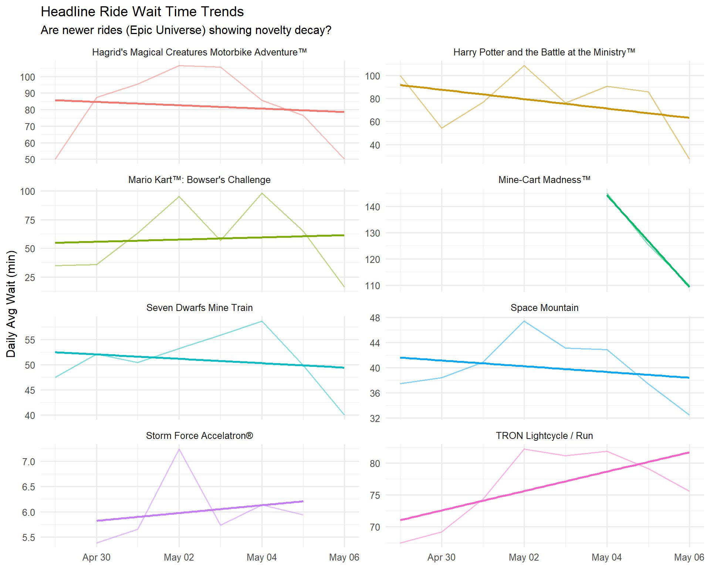
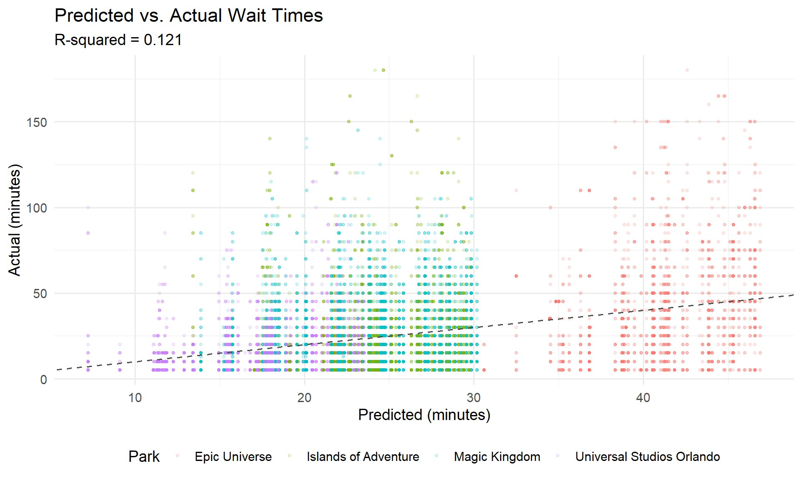

# 🎢 Analyzing Orlando Theme Park Wait Times

**A data-driven exploration of ride wait times across four major Orlando theme parks.**

Evan Morrison · Introduction to Statistics · Westminster University · Spring 2026

---

## Overview

How long will you wait in line at Orlando's biggest theme parks? This project collects and analyzes real-time ride wait times across **Magic Kingdom**, **Universal Studios Orlando**, **Islands of Adventure**, and the newly opened **Epic Universe** — examining how wait times vary by time of day, day of week, park, and weather conditions.

The analysis includes ANOVA testing, regression modeling, Disney vs. Universal comparisons, and a novelty decay investigation into whether brand-new Epic Universe rides are seeing declining waits as the opening hype fades.

### Research Questions

1. **Time-of-day & day-of-week effects** — Is there a statistically significant difference in average wait times across different times of day or days of the week?
2. **Regression modeling** — What variables (time of day, park, weather, weekend status) best predict ride wait times?
3. **Disney vs. Universal** — Do wait times differ significantly between Disney and Universal parks?
4. **Novelty decay** — Do newly opened rides show decreasing wait times as the novelty wears off?

## Key Findings

- **Afternoons are the worst.** ANOVA and Tukey's HSD confirmed that afternoon wait times are significantly higher than all other periods (p < 0.001).
- **Epic Universe dominates.** Mean wait of 39.3 minutes — nearly double Universal Studios Orlando (18 min). Its trend line actually slopes *upward*, suggesting novelty demand hasn't peaked.
- **Disney vs. Universal** — A Welch's t-test found a statistically significant difference, though the practical gap is small. Similar medians, but Disney has a slightly higher mean.
- **Weather matters modestly.** Mild temperatures correlated with longer waits than cool or hot conditions.
- **Regression model (R² = 0.101)** — Park identity and time of day are the strongest predictors. The low R² reflects high ride-to-ride variability not captured by aggregate predictors.

**Advice for park visitors:** go at night, skip Mondays, and expect Epic Universe lines to stay long for a while.

## Sample Results

### Wait Time Distributions


### Time of Day Effects


### Top 15 Rides


### Day of Week Patterns


### Disney vs. Universal


### Weather Effects


### Novelty Decay Analysis


### Headline Ride Trends


### Regression Model


## Data

| Source | Description |
|--------|-------------|
| [Queue-Times.com](https://queue-times.com/) | Live posted wait times for rides at parks worldwide |
| [Open-Meteo](https://open-meteo.com/) | Hourly temperature, precipitation, and weather codes for Orlando, FL |

**Collection method:** An R script (`save_snapshot.R`) runs every 30 minutes via Windows Task Scheduler, querying the Queue-Times.com API for four parks and appending results to a CSV. Data was collected continuously for approximately one week (April 29 – May 5, 2026).

### Parks Tracked

| Park | Queue-Times ID | Operator |
|------|:--------------:|----------|
| Magic Kingdom | 6 | Disney |
| Universal Studios Orlando | 65 | Universal |
| Islands of Adventure | 64 | Universal |
| Epic Universe | 334 | Universal |

### Data Cleaning

Observations with wait times above 180 minutes were filtered out — the Queue-Times API can return placeholder values up to 1,000 minutes that represent errors, not real waits. The cleaned dataset contains **~10,900 observations** across 4 parks and 78 rides.

## Project Structure

```
├── ThemeParkWaitTimes.qmd    # Main Quarto analysis notebook
├── ThemeParkWaitTimes.html   # Rendered report
├── save_snapshot.R           # Automated data collection script
├── data/
│   └── wait_times_log.csv    # Collected wait time data
├── screenshots/              # Chart images for README
└── README.md
```

## Statistical Methods

- **ANOVA + Tukey's HSD** — Testing differences in wait times across time-of-day categories
- **Welch's t-test** — Comparing Disney vs. Universal wait time distributions
- **Multiple linear regression** — Modeling wait times from park, time of day, weekend status, temperature category, and rain
- **Linear trend analysis** — Testing for novelty decay slopes per park over time

## Reproducing This Analysis

### Prerequisites

- **R** (≥ 4.0) and **RStudio**
- **Quarto** (for rendering the `.qmd` notebook)

### Install Packages

```r
install.packages(c("tidyverse", "jsonlite", "lubridate",
                    "scales", "knitr", "broom", "gridExtra"))
```

### Collect Data

Run `save_snapshot.R` manually or set up automated collection:

**Windows (Task Scheduler):**
1. Create Basic Task → trigger every 30 minutes
2. Action → Start a Program:
   - Program: `C:\Program Files\R\R-4.x.x\bin\Rscript.exe`
   - Arguments: `save_snapshot.R`
   - Start in: your project directory

**Mac/Linux (cron):**
```
*/30 * * * * cd /path/to/project && Rscript save_snapshot.R >> data/cron_log.txt 2>&1
```

### Render the Report

```bash
quarto render ThemeParkWaitTimes.qmd
```

## Limitations

- Data spans ~7 days (late April to early May); a longer collection period would strengthen seasonal analysis.
- Posted wait times may overestimate actual experienced waits by 10–15%.
- The 180-minute filter removes API artifacts but may clip genuine peak waits on rare occasions.
- The regression model does not capture ride-specific factors like virtual queue effects or Lightning Lane availability.

## Tools & Technologies

R · Tidyverse · ggplot2 · Quarto · Open-Meteo API · Queue-Times.com API

---

*Data powered by [Queue-Times.com](https://queue-times.com/). Weather data from [Open-Meteo](https://open-meteo.com/).*
